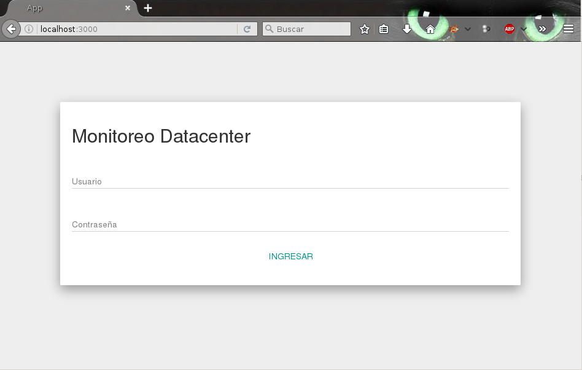

# Manual de instalación del servicio para obtener información del estado de los sensores ambientales (Frontend)
## Instalacion de programas basicos
```sh
sudo apt-get update
sudo apt-get install -y curl
sudo apt-get install -y git
```
## Instalación de Node

```sh
curl -sL https://deb.nodesource.com/setup_4.x | sudo -E bash -
sudo apt-get install -y nodejs
sudo apt-get install -y build-essential
```
## Descargar el codigo del frontend
Clonar la aplicación del repositorio de GitLab

```sh
git clone https://github.com/kiritodeveloper/sis-data-manage/frontend

```
**Nota.-** Si obtiene el mensaje: *"serve certificate verification failed"*, introducir el siguiente comando:

```sh
git config  --global http.sslverify false
```
## Compilar el programa
Ingresar a la carpeta del codigo fuente en especifico a la carpeta frontend

```sh
cd sis-data-manage
cd frontend
```
Configurar la IP donde esta instalado el servidor

```sh
nano app/configuracion.js
```
Editar la primera linea segun corresponda a su ip

```javascript
var ip_backend='127.0.0.1';

exports.bd = {
  usuarios: 'mongodb://'+ip_backend+':27017/usuarios',
  sensores: 'mongodb://'+ip_backend+':27017/sensores_control_ambiental_datacenter'
}

exports.clave = {
.
.
.
```

```sh
nano publico/js/app.js
```
Editar la primera linea segun corresponda a su ip

```javascript
var serv_backend='http://127.0.0.1:3000';

var app = angular.module('app', ['ngRoute', 'angular-jwt']);

app.config(function($routeProvider, $locationProvider, $httpProvider, jwtInterceptorProvider) {
.
.
.
```
Instalar las dependencias necesarias

```sh
npm install
```
Ejecutar el programa:

```sh
node app.js
```
Para comprobar que el frontend este corriendo ingresar en el navegador a la ruta <http://localhost:3000>



## Instalar el programa como servicio
Instalar Supervisor para que el servidor pueda ejecutar la aplicación como servicio

```sh
sudo apt-get install supervisor
sudo /etc/init.d/supervisor restart
```
Crear el archivo de configuracion

```sh
sudo nano /etc/supervisor/conf.d/frontend-sensores.conf
```
Ejemplo de contenido del archivo *frontend-sensores.conf*. Se Debe cambiar los nombres de la ruta con las que correspondan a tu aplicación.

```sh
[program:run-frontend-sensores]
directory=/home/jaimito/desarrollo/sis-data-manage/frontend
command=node app.js
autostart=true
autorestart=true
stderr_logfile=/var/log/frontend-sensores.err.log
```
Reiniciar supervisor, para que los cambios tomen efecto.

```sh
sudo /etc/init.d/supervisor restart
```