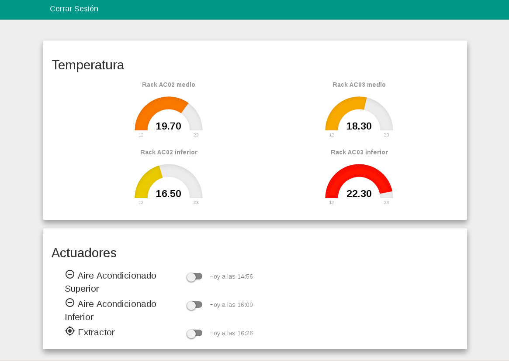

# FrontEnd de los sensores ambientales del data center

Permite tener una interfaz en donde se tiene una vista del estado de los sensores ambientales del data center



Para este frontend es necesario tener instalado **Node v4.3**
Esta vista solo es compatible con el navegador Google Chome <https://www.google.com/chrome/>

para la ejecucion del programa
```sh
npm install
node app.js
```
Para una instalación en modo de producción consulte [INSTALL.md](INSTALL.md "Archivo INSTALL.md")
